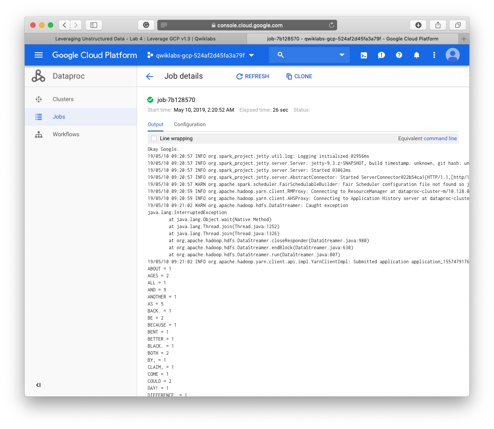

### PySpark Jobs & Cloud Storage

#### Objective
* Explore Spark using PySpark jobs
* Using Cloud Storage instead of HDFS
* Run a PySpark application from Cloud Storage
* Using Python Pandas to add BigQuery to a Spark application

#### Advantages of Cloud Storage
* You can shut down the cluster when you are not running jobs. The storage persists even when the cluster is shut down, so you don't have to pay for the cluster just to maintain data in HDFS.
* In some cases Cloud Storage provides better performance than HDFS.
* Cloud Storage does not require the administration overhead of a local file system.

#### Setup
* Setup a Dataproc cluster. SSH into master node.
* Setup a storage bucket. Add environment variable `BUCKET` in the master node.

```bash
BUCKET=<bucket-name>
echo $BUCKET
```

* Copy file to Cloud Storage.

```bash
gsutil cp /training/road-not-taken.txt gs://$BUCKET
```

#### Debug
Debug by running PySpark program on Cloud Shell. Note that file path is pointing to Cloud Storage, not HDFS. Run job locally by entering `spark-submit wordcount.py`.

```Python
from pyspark.sql import SparkSession
from operator import add
import re
print("Okay Google.")
spark = SparkSession\
        .builder\
        .appName("CountUniqueWords")\
        .getOrCreate()
lines = spark.read.text("gs://qwiklabs-gcp-524af2d45fa3a79f/road-not-taken.txt").rdd.map(lambda x: x[0])
# lines = spark.read.text("/sampledata/road-not-taken.txt").rdd.map(lambda x: x[0])
counts = lines.flatMap(lambda x: x.split(' ')) \
                  .filter(lambda x: re.sub('[^a-zA-Z]+', '', x)) \
                  .filter(lambda x: len(x)>1 ) \
                  .map(lambda x: x.upper()) \
                  .map(lambda x: (x, 1)) \
                  .reduceByKey(add) \
                  .sortByKey()
output = counts.collect()
for (word, count) in output:
  print("%s = %i" % (word, count))
spark.stop()
```

#### Deploy
1. Copy bug-free file to Cloud Storage: `gsutil cp wordcount.py gs://$BUCKET`.
2. Go to Dataproc, Jobs, Submit Jobs.
    * region: same as Dataproc region.
    * cluster: name of dataproc cluster.
    * job type: PySpark
    * Main Python file: gs://<your bucket>/wordcount.py



#### Take-away:
* HDFS is still used temporarily, to connect Cloud Storage and Dataproc clusters.
* Because data transfer is so fast, it's okay to copy from Cloud Storage, rendering the server stateless.
* Modifying an existing program is simple as replacing the file location from `hdfs://` to `gs://`
