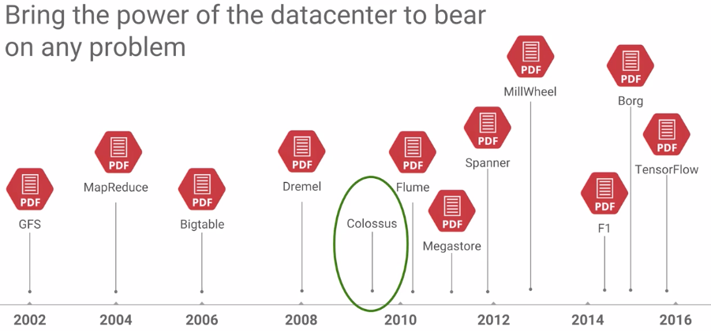
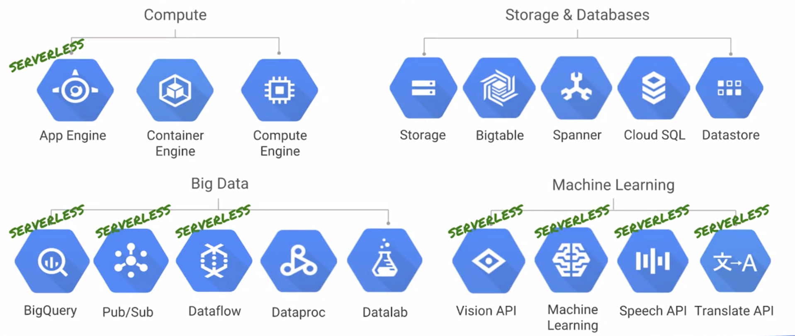

### Mining Unstructured Data with Cloud Dataproc
This folder contains notes for the Coursera class *Leveraging Unstructured Data with Cloud Dataproc on Google Cloud Platform* ([link](https://www.coursera.org/learn/leveraging-unstructured-data-dataproc-gcp/home/welcome))
* Unstructured data: big data that you collect but don't analyze: email, news group, field inspection photos.
* Structured data have schema: rows columns and formal relationship.
* Unstructured data are defined in relative terms: can be structured for one task, but unstructured for another task (even if it has schema).
* Over 90% of enterprise data are unstructured.
> Structured data has a useful organization or schema. Unstructured data includes not only data that is without a schema, but also data that has some structure, but that structure is not useful for the intended analysis or query.

#### Approach to Big Data
* Vertical scaling: more powerful computer.
* Horizontal scaling: more computing nodes.
* Google File System -> Hadoop, HDFS
    - Hadoop, Pig, Hive, Spark

#### Operational Issues with Managing a Cluster
* Equipment, power.
* Utilization.
* Scaling.
* Sharding, rebalancing.

#### Ways to Create Dataproc Cluster
* a deployment manager **template**, which is an infrastructure *automation service* in Google Cloud
* CLI command. Custom VM e.g. 6 CPU, 30 GB * 1024 = 30720:
```bash
gcloud dataproc clusters create test-cluster /
    --worker-machine-type custom-6-30720
    --worker-machine-type custom-6-23040
```
* Google Cloud Console.
    * Create one cluster per job.
    * Give a unique name
    * Zone is important: same zone as data storage (where compute nodes are located) to minimize egress charge.

#### Preemptible VM
* Up to 80% discount. At the risk of being taken away as persistent VM.
* Used for non-critical jobs; processing only, not HDFS/data storage.
* > 50% preemptible VM has diminishing return and higher likelihood of failure.
* Busy regions may not have available preemptible VM.

#### Submitting Jobs
* Hadoop Job Interface/Resource manager: master node port 8088 (check job status).
* Hadoop Admin interface: master node 9870 (check file system).

#### HiveQL
* Hive is declarative: specify how exactly to perform data analysis. Can't decide how to use resources.
* Pig makes execution plan, requests underlying system to determine how to process data (*Pipeline Paradigm*).

#### MapReduce: Separation of Storage and Compute
* "Bring the data to the compute" -> Slow, expensive, didn't scale.
* Sharding: to split the data as it's being copied in from mass storage, and distribute it to the nodes.
* Mean time between failure: (MTBF): 3 years.
* Pre-shard data on cluster instead of on data center.
* Annealing / self-healing: auto copy when number drops below 3.
* Hot-spot: some nodes are used a lot but others are not. Solve by rebalancing.

> The reality is that you have to constantly experiment with the resources available and their capacity to perform work with the types of jobs and types of data in your business. You have to constantly forecast and adjust. Optimization of a cluster isn't about how much money you can invest, it's about how fast you can iterate and adapt to the changing business requirements.



#### Evolution of data processing
* In 2006, Google develops **Bigtable**: a high throughput, low latency, no SQL data service for handling massive workloads.
* In 2008, Google develops a distributed large data set query engine called **Dremel**, which is the query engine used in BigQuery.
* Around 2010, Google develops a replacement for GFS internally named **Colossus**, and today known as **Cloud storage**. It's a global file system, it's integrated with advanced Google networking and it enables many Cloud-based services.

#### Three Categories of Services
* Server-oriented: provides you with a server and you're responsible for installing software, configuring it, and using it (Compute Engine, Container Engine).
* Managed services provider a server or a cluster of servers, but the caller is not completely responsible for the server (Cloud SQL, Dataproc).
* Serverless: no server instance or serve extraction (BigQuery, PubSub, Dataflow).
* High bisection-bandwidth: any server can communicate with other server at full speed. Just use data from where it's stored!


#### Submitting Spark Jobs
* Copy data to Cloud Storage.
* Update file prefix from `hdfs://` (HDFS redundant storage) to `gs://` (HDFS temporary storage)
* Create a Dataproc cluster and run the job.

#### Spark Concepts
* RDDs or resilient distributed data sets hide the complexity of the location of data within the cluster and also the complexity of replication.
* **Lazy execution**: requests are not immediately executed, but stored in directed, acyclic graph.

There are two classes of operations: transformations and actions. A transformation takes one RDD as input and generates another RDD as output. You can think of a transformation as a request. It explains to Spark what you want done, but doesn't tell Spark how to do it.

Actions like "collect", "count", or "take" produce a result, such as a number or a list.

When Spark receives transformations, it stores them in a DAG (Directed Acyclic Graph) but doesn't perform them at that time. When Spark receives an action it examines the transformations in the DAG and the available resources (number of workers in the cluster), and creates pipelines to efficiently perform the work.

#### PySpark
PySpark is a Read-Evaluate-Print-Loop (REPL) interpreter. Also known as a language shell. The REPL reads a single expression from the user, evaluates it, and prints the result. Then it loops and performs another single expression. The single-step immediate feedback of a REPL makes it useful for exploring and learning a language or system. The limitation is that the REPL holds no state context of its own, unlike more sophisticated shells.

#### RDD
A Resilient Distributed Dataset (RDD) is an abstraction over data in storage. The RDD is opaque to the location and replication of data it contains. For reliability, RDDs are resilient (fault-tolerant) to data loss due to node failures. An RDD lineage graph is used to recompute damaged or missing partitions. And for efficiency, Spark might choose to process one part in one location or another, based on availability of CPU at that location, or based on network latency or proximity to other resources.

The benefit of this abstraction is that it enables operations on an RDD to treat the RDD as a single object and ignore the complexity of how data is located, replicated, and migrated inside the RDD. All those details are left to Spark.

#### Labs
1. Create environment variables in Cloud Shell ([Note](lab_1.md)).
2. Work with structured and semi-structured data ([Note](lab_2.md)).
3. Submit Dataproc jobs for unstructured data ([Note](lab_3.md)).
4. PySpark Jobs & Cloud Storage ([Note](lab_4.md)).
5. Cluster automation using CLI commands ([Note](lab_5.md)).
6. PySpark Machine Learning ([Note](lab_6.md)).
