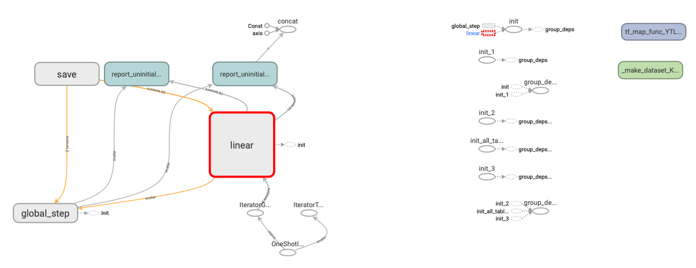

### Distributed training and monitoring

Code study: [notebok](https://github.com/shawlu95/training-data-analyst/blob/master/courses/machine_learning/tensorflow/d_traineval.ipynb)
* `serving_input_fn` is used in exporter definition.
* `serving_input_receiver_fn`: a function that takes no arguments and returns a `ServingInputReceiver`.

```python
def serving_input_fn():
  # Add a dimension to each feature
  feature_placeholders = {
    'pickuplon' : tf.placeholder(tf.float32, [None]),
    'pickuplat' : tf.placeholder(tf.float32, [None]),
    'dropofflat' : tf.placeholder(tf.float32, [None]),
    'dropofflon' : tf.placeholder(tf.float32, [None]),
    'passengers' : tf.placeholder(tf.float32, [None]),
  }
  features = {
      key: tf.expand_dims(tensor, -1)
      for key, tensor in feature_placeholders.items()
  }
  return tf.estimator.export.ServingInputReceiver(features, feature_placeholders)

  def train_and_evaluate(output_dir, num_train_steps):
    estimator=tf.estimator.LinearRegressor(
      model_dir=output_dir,
      feature_columns=feature_cols)

    train_spec=tf.estimator.TrainSpec(
      input_fn=read_dataset('./taxi-train.csv', mode=tf.estimator.ModeKeys.TRAIN),
      max_steps=num_train_steps)

    exporter = tf.estimator.LatestExporter('exporter', serving_input_fn)
    eval_spec=tf.estimator.EvalSpec(
      input_fn=read_dataset('./taxi-valid.csv', mode=tf.estimator.ModeKeys.EVAL),
      steps=None,
      start_delay_secs=1, # start evaluating after N seconds
      throttle_secs=10,  # evaluate every N seconds
      exporters=exporter)

    tf.estimator.train_and_evaluate(estimator, train_spec, eval_spec)
```

#### TensorBoard
The following code will start TensorBoard, and print a link to access it.
```Python
from google.datalab.ml import TensorBoard
TensorBoard().start('./taxi_trained')
TensorBoard().list()

# to stop TensorBoard
for pid in TensorBoard.list()['pid']:
    TensorBoard().stop(pid)
```


