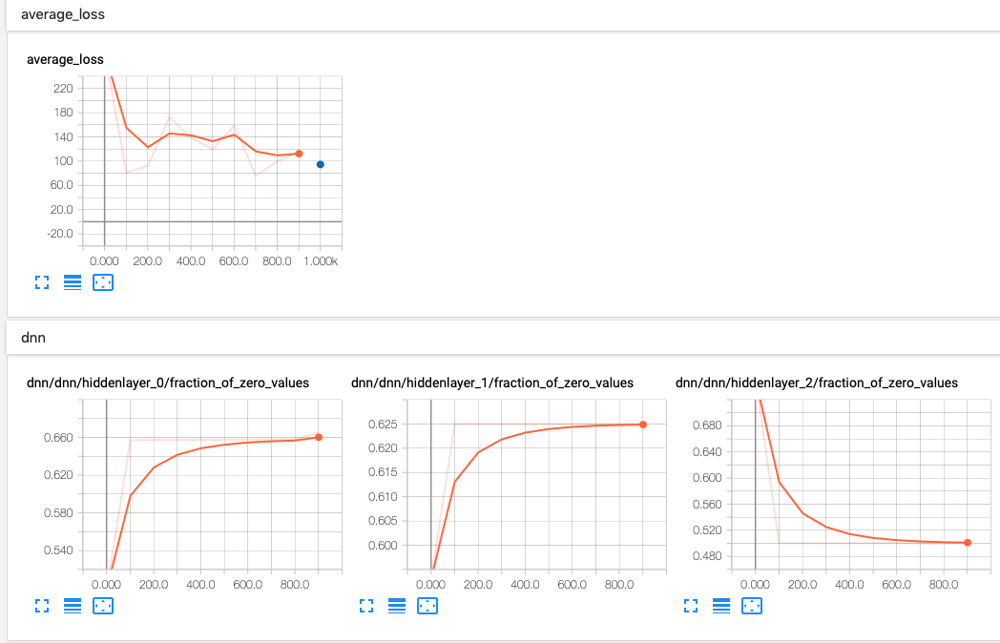

### Scaling up ML using Cloud ML Engine

Code study: [cloudmle.ipynb](https://github.com/shawlu95/training-data-analyst/blob/master/courses/machine_learning/cloudmle/cloudmle.ipynb)

#### Objective
* Package up the code
* Find absolute paths to data
* Run the Python module from the command line
* Run locally using gcloud
* Submit training job using gcloud
* Deploy model
* Prediction
* Train on a 1-million row dataset

#### Notes
* `--package-path` points to a folder containing both `model.py` and `task.py`.
* Export variable from Python to bash: `os.environ['PROJECT'] = PROJECT`.
* Retrieve variable from bash `PROJECT_ID=$PROJECT`.

#### Authorize access to storage bucket:

```bash
PROJECT_ID=$PROJECT
AUTH_TOKEN=$(gcloud auth print-access-token)
SVC_ACCOUNT=$(curl -X GET -H "Content-Type: application/json" \
    -H "Authorization: Bearer $AUTH_TOKEN" \
    https://ml.googleapis.com/v1/projects/${PROJECT_ID}:getConfig \
    | python -c "import json; import sys; response = json.load(sys.stdin); \
    print(response['serviceAccount'])")

echo "Authorizing the Cloud ML Service account $SVC_ACCOUNT to access files in $BUCKET"
gsutil -m defacl ch -u $SVC_ACCOUNT:R gs://$BUCKET
gsutil -m acl ch -u $SVC_ACCOUNT:R -r gs://$BUCKET  # error message (if bucket is empty) can be ignored
gsutil -m acl ch -u $SVC_ACCOUNT:W gs://$BUCKET
```

#### Local Run
* Train model locally from CLI:

```bash
%bash
rm -rf taxifare.tar.gz taxi_trained
export PYTHONPATH=${PYTHONPATH}:${PWD}/taxifare
python -m trainer.task \
   --train_data_paths="${PWD}/taxi-train*" \
   --eval_data_paths=${PWD}/taxi-valid.csv  \
   --output_dir=${PWD}/taxi_trained \
   --train_steps=1000 --job-dir=./tmp
```

* Train model locally using `gcloud`:

```bash
%bash
rm -rf taxifare.tar.gz taxi_trained
gcloud ml-engine local train \
   --module-name=trainer.task \
   --package-path=${PWD}/taxifare/trainer \
   -- \
   --train_data_paths=${PWD}/taxi-train.csv \
   --eval_data_paths=${PWD}/taxi-valid.csv  \
   --train_steps=1000 \
   --output_dir=${PWD}/taxi_trained
```

#### Cloud Run
Takes a while. Cloud MLE is not available, and has become part of the AI Platform.
```bash
# copy files to cloud
gsutil -m rm -rf gs://${BUCKET}/taxifare/smallinput/
gsutil -m cp ${PWD}/*.csv gs://${BUCKET}/taxifare/smallinput/

OUTDIR=gs://${BUCKET}/taxifare/smallinput/taxi_trained
JOBNAME=lab3a_$(date -u +%y%m%d_%H%M%S)
gsutil -m rm -rf $OUTDIR
gcloud ml-engine jobs submit training $JOBNAME \
   --region=$REGION \
   --module-name=trainer.task \
   --package-path=${PWD}/taxifare/trainer \
   --job-dir=$OUTDIR \
   --staging-bucket=gs://$BUCKET \
   --scale-tier=BASIC \
   --runtime-version=$TFVERSION \
   -- \
   --train_data_paths="gs://${BUCKET}/taxifare/smallinput/taxi-train*" \
   --eval_data_paths="gs://${BUCKET}/taxifare/smallinput/taxi-valid*"  \
   --output_dir=$OUTDIR \
   --train_steps=10000
```



#### Deploy Model

```bash
MODEL_NAME="taxifare"
MODEL_VERSION="v1"
MODEL_LOCATION=$(gsutil ls gs://${BUCKET}/taxifare/smallinput/taxi_trained/export/exporter | tail -1)
#gcloud ml-engine versions delete ${MODEL_VERSION} --model ${MODEL_NAME}
#gcloud ml-engine models delete ${MODEL_NAME}
gcloud ml-engine models create ${MODEL_NAME} --regions $REGION
gcloud ml-engine versions create ${MODEL_VERSION} --model ${MODEL_NAME} --origin ${MODEL_LOCATION} --runtime-version $TFVERSION
```

#### Predict
Predict via CLI:
```bash
gcloud ml-engine predict --model=taxifare --version=v1 --json-instances=./test.json
```
