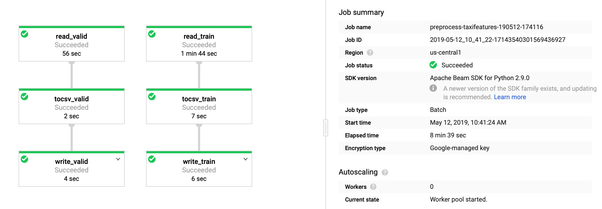

### Feature Engineering

Code study:
* Original [feateng.ipynb](https://github.com/shawlu95/training-data-analyst/blob/master/courses/machine_learning/feateng/feateng.ipynb)
* Commented [feateng.ipynb](code/feateng.ipynb)
* Original [model.py](https://github.com/shawlu95/training-data-analyst/blob/master/courses/machine_learning/feateng/taxifare/trainer/model.py)
* Original [task.py](https://github.com/shawlu95/training-data-analyst/blob/master/courses/machine_learning/feateng/taxifare/trainer/task.py)

#### Objective
* Working with feature columns
* Adding feature crosses in TensorFlow
* Reading data from BigQuery
* Creating datasets using Dataflow
* Using a wide-and-deep model

* Can do preprocessing and cleanup inside Dataflow, but then we'll have to remember to repeat that prepreprocessing during inference.
* Better to use tf.transform which will do this book-keeping

#### Dataflow Pipelines
* Create two parallel pipelines: train and validation. Each stage is given a string name.
* Convert day of week to String: there's something you can do in the Dataflow



```Python
#instantiate PipelineOptions object using options dictionary
opts = beam.pipeline.PipelineOptions(flags=[], **options)
#instantantiate Pipeline object using PipelineOptions
with beam.Pipeline(options=opts) as p:
  for phase in ['train', 'valid']:
    query = create_query(phase, EVERY_N)
    outfile = os.path.join(OUTPUT_DIR, '{}.csv'.format(phase))
    (
      p | 'read_{}'.format(phase) >> beam.io.Read(beam.io.BigQuerySource(query=query))
        | 'tocsv_{}'.format(phase) >> beam.Map(to_csv)
        | 'write_{}'.format(phase) >> beam.io.Write(beam.io.WriteToText(outfile))
    )
```

#### Data Engineering
* To print definition in bash: `grep -A 20 "INPUT_COLUMNS =" taxifare/trainer/model.py`
* `INPUT_COLUMNS` to be used by neural network. It is a list of TensorFlow columns, but doen't contian actual data.
* Do feature cross between day-hour, longitude latitude, then make embedding of given dimension.
* `linear_feature_column` params accepts wide columns.
* `dnn_feature_columns` params accepts deep columns.

```python
INPUT_COLUMNS = [
    # Define features
    tf.feature_column.categorical_column_with_vocabulary_list('dayofweek', vocabulary_list = ['Sun', 'Mon', 'Tues', 'Wed', 'Thu', 'Fri', 'Sat']),
    tf.feature_column.categorical_column_with_identity('hourofday', num_buckets = 24),

    # Numeric columns
    tf.feature_column.numeric_column('pickuplat'),
    tf.feature_column.numeric_column('pickuplon'),
    tf.feature_column.numeric_column('dropofflat'),
    tf.feature_column.numeric_column('dropofflon'),
    tf.feature_column.numeric_column('passengers'),

    # Engineered features that are created in the input_fn
    # how far people travelled
    tf.feature_column.numeric_column('latdiff'),
    tf.feature_column.numeric_column('londiff'),
    tf.feature_column.numeric_column('euclidean')
]
```
